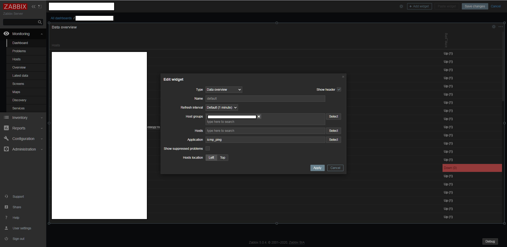
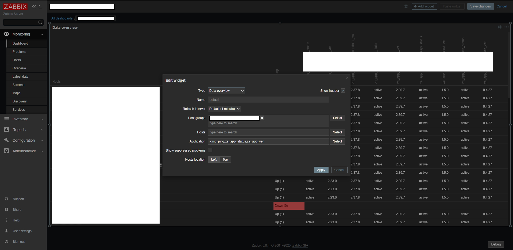

# Zabbix_use_multiple_application
Use multiple application name in Data Overview widget

- In Zabbix 5.0.2 haven't multiple select application at Data Overview widget.
I changed code at **"/usr/share/zabbix/include/items.inc.php"**
and now you can display some applications separated by **","**

-- You can yourself modifide code or download prepared file

---

Replace original code at /usr/share/zabbix/include/items.inc.php
```
function getDataOverviewItems(?array $groupids = null, ?array $hostids = null, ?string $application = ''): array {
        $config = select_config();
        if ($application !== '') {
            $applicationids = array_keys(API::Application()->get([
                    'output' => [],
                    'hostids' => $hostids,
                    'groupids' => $groupids,
                    'search' => ['name' => $application],
                    'preservekeys' => true
            ]));
			$db_items = API::Item()->get([
                'output' => ['itemid', 'hostid', 'name', 'key_', 'value_type', 'units', 'valuemapid'],
                'applicationids' => $applicationids,
                'monitored' => true,
                'webitems' => true,
                'limit' => $config['search_limit'],
                'preservekeys' => true
			]);
		}
```
To
```
function getDataOverviewItems(?array $groupids = null, ?array $hostids = null, ?string $application = ''): array {
        $config = select_config();
        if ($application !== '') {
                if (stristr($application, ',') == True) {
                        $applicationids = array();
                        foreach (explode(',', $application) as $app) {
                                $applicationids = array_merge($applicationids, array_keys(API::Application()->get([
                                        'output' => [],
                                        'hostids' => $hostids,
                                        'groupids' => $groupids,
                                        'search' => ['name' => $app],
                                        'preservekeys' => true
                                ])));
//                              error_log($app . '\\n\\n' . implode(',', $applicationids) . '\\n\\n',0);
                        }
//              error_log($application . '\n\n' . implode(',', $applicationids) . '\n\n',0);
                }
                else
                {
                        $applicationids = array_keys(API::Application()->get([
                                'output' => [],
                                'hostids' => $hostids,
                                'groupids' => $groupids,
                                'search' => ['name' => $application],
                                'preservekeys' => true
                        ]));
                        error_log($application . '\n\n' . implode(',', $applicationids) . '\n\n',0);
                }
                $db_items = API::Item()->get([
                        'output' => ['itemid', 'hostid', 'name', 'key_', 'value_type', 'units', 'valuemapid'],
                        'applicationids' => $applicationids,
                        'monitored' => true,
                        'webitems' => true,
                        'limit' => $config['search_limit'],
                        'preservekeys' => true
                ]);
        }
```

To Debugging, uncomment lines with **"error_log"**
Debbug messages you can read at **"/var/log/{httpd|nginx}/error_log"**
